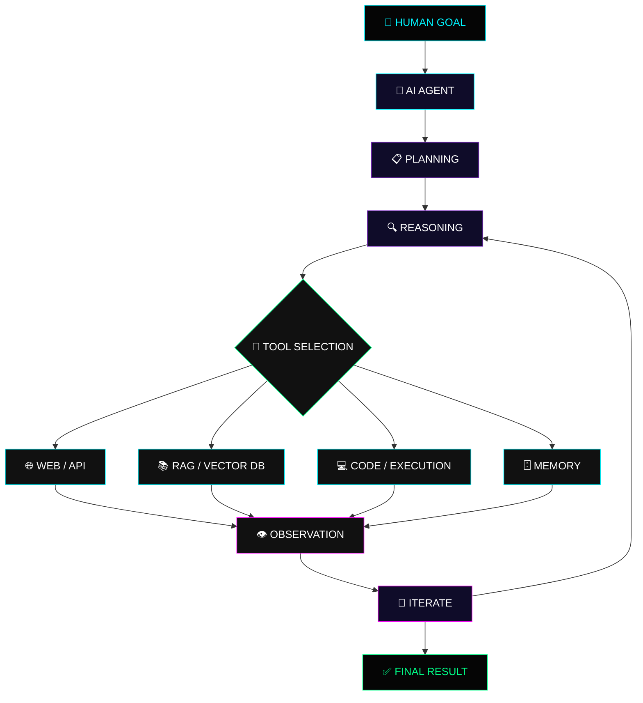

<div align="center">

<!-- ═══════════════════════════════════════════════════════════════ -->

<!--                       NEON HERO HEADER                         -->

<!-- ═══════════════════════════════════════════════════════════════ -->


<br>

<!-- ═══════════════════════════════════════════════════════════════ -->

<!--                       TYPING ANIMATION                         -->

<!-- ═══════════════════════════════════════════════════════════════ -->

<a href="https://github.com/dhilleswar07">


</a>

<br><br>

<!-- ═══════════════════════════════════════════════════════════════ -->

<!--                         STATUS BADGES                          -->

<!-- ═══════════════════════════════════════════════════════════════ -->


</div>

---

<!-- ═══════════════════════════════════════════════════════════════ -->

<!--                         PROFILE CARD                          -->

<!-- ═══════════════════════════════════════════════════════════════ -->

## `> whoami`

<table>
<tr>
<td width="35%" align="center">


<br><br>


<br>


</td>

<td width="65%">

```text
╔══════════════════════════════════════════════════╗
║                 SYSTEM PROFILE                   ║
╠══════════════════════════════════════════════════╣
║                                                  ║
║  NAME       : Dhilleswar Jogi                    ║
║  ROLE       : AI / Data Science Enthusiast       ║
║  FOCUS      : Generative AI + Agentic AI         ║
║  DOMAIN     : Machine Learning + Computer Vision ║
║  LANGUAGE   : Python + SQL                       ║
║  STATUS     : ONLINE ●                           ║
║                                                  ║
║  MISSION:                                        ║
║  Build intelligent systems that solve            ║
║  real-world problems.                            ║
║                                                  ║
╚══════════════════════════════════════════════════╝
```

</td>
</tr>
</table>

---

# ⚡ `SYSTEM_STATUS`

<div align="center">

| DOMAIN               |          LEVEL         |   STATUS   |
| :------------------  | :--------------------: | :--------: |
| 🐍 Python           | `██████████████████░░` |  `ACTIVE`  |
| 🧠 Machine Learning | `████████████████░░░░` |  `ACTIVE`  |
| 🤖 Generative AI    | `█████████████████░░░` | `BUILDING` |
| ⚡ Agentic AI       | `███████████████░░░░░` | `BUILDING` |
| 👁️ Computer Vision  | `████████████████░░░░` |  `ACTIVE`  |
| 🔎 RAG / LLM Apps   | `██████████████░░░░░░` | `LEARNING` |
| 🚀 MLOps / CI-CD    | `███████████░░░░░░░░░` | `LEARNING` |

</div>

---

# 🖥️ `TERMINAL`

<div align="center">

```text
┌──────────────────────────────────────────────────────────────┐
│  ● ● ●             dhilleswar@ai-lab:~                       │
├──────────────────────────────────────────────────────────────┤
│                                                              │
│  $ initialize_dhilleswar                                     │
│                                                              │
│  [✓] Loading AI modules...                                   │
│  [✓] Loading Machine Learning...                             │
│  [✓] Loading Generative AI...                                │
│  [✓] Loading Agentic AI...                                   │
│  [✓] Loading Computer Vision...                              │
│  [✓] Loading Data Science...                                 │
│                                                              │
│  $ current_status                                            │
│                                                              │
│  > AI Engineering      : ONLINE                              │
│  > Learning Mode       : ACTIVE                              │
│  > Building Mode       : ACTIVE                              │
│  > Open Source         : EXPLORING                           │
│                                                              │
│  $ echo "Let's build intelligent systems."                   │
│                                                              │
│  Let's build intelligent systems. 🤖                        │
│                                                              │
└──────────────────────────────────────────────────────────────┘
```

</div>

---

# 🧠 `AI_ENGINEERING_STACK`

<div align="center">

### `CORE`


<br><br>

### `DATA SCIENCE`


<br><br>

### `MACHINE LEARNING`


<br><br>

### `GENERATIVE AI`


<br><br>

### `COMPUTER VISION`


<br><br>

### `DEPLOYMENT`


</div>

---

# ⚡ `AGENTIC_AI_ARCHITECTURE`

<div align="center">



</div>

---

# 🤖 `AGENTIC_AI_LAB`

<div align="center">


</div>

```text
                     ┌─────────────────┐
                     │    AI AGENT     │
                     └────────┬────────┘
                              │
                ┌─────────────┼─────────────┐
                │             │             │
                ▼             ▼             ▼
           🧠 REASON      🔧 TOOLS      💾 MEMORY
                │             │             │
                └─────────────┼─────────────┘
                              │
                              ▼
                       ⚡ AUTONOMOUS
                         WORKFLOW
                              │
                              ▼
                       🎯 FINAL RESULT
```

---

# 📡 `CURRENTLY_EXPLORING`

<div align="center">

```text
╔══════════════════════════════════════════════════════╗
║                  LEARNING PIPELINE                   ║
╠══════════════════════════════════════════════════════╣
║                                                      ║
║  🤖 Advanced Generative AI                           ║
║       └── LLMs / RAG / Fine-Tuning                  ║
║                                                      ║
║  ⚡ Agentic AI                                       ║
║       └── Agents / Tools / Memory / Workflows       ║
║                                                      ║
║  🧠 LLM Engineering                                  ║
║       └── Prompting / Evaluation / Guardrails       ║
║                                                      ║
║  🚀 MLOps                                            ║
║       └── Docker / CI-CD / Deployment               ║
║                                                      ║
║  👁️ Computer Vision                                  ║
║       └── YOLO / OpenCV / MediaPipe / OCR          ║
║                                                      ║
╚══════════════════════════════════════════════════════╝
```

</div>

---

# 📊 `LIVE_GITHUB_DASHBOARD`

<div align="center">


<br><br>


</div>

---

# 🔥 `GITHUB_STREAK`

<div align="center">


</div>

---

# 🐍 `CONTRIBUTION_SNAKE`

<div align="center">


</div>

---

# 🏆 `ACHIEVEMENTS`

<div align="center">


</div>

---

# 📈 `ACTIVITY_MONITOR`

<div align="center">


</div>

---

# 🎯 `2026_MISSION`

```text
┌──────────────────────────────────────────────────────────┐
│                     2026 MISSION                         │
├──────────────────────────────────────────────────────────┤
│                                                          │
│  [✓] Data Science                                       │
│  [✓] Machine Learning                                   │
│  [✓] Generative AI                                     │
│  [✓] Computer Vision                                   │
│  [✓] Agentic AI Exploration                            │
│                                                          │
│  [→] Advanced RAG                                      │
│  [→] LLM Fine-Tuning                                   │
│  [→] Production AI Agents                              │
│  [→] MLOps / CI-CD                                     │
│  [→] Open Source Contributions                          │
│                                                          │
│                 STATUS: BUILDING 🚀                     │
│                                                          │
└──────────────────────────────────────────────────────────┘
```

---

# 🧬 `ENGINEERING_MINDSET`

<div align="center">

### `LEARN → EXPERIMENT → BUILD → DEPLOY → MEASURE → IMPROVE`

<br>

> **"Don't just use AI. Understand it. Build with it. Improve it."**

</div>

---

# 🌐 `CONNECT_WITH_ME`

<div align="center">

<a href="https://github.com/dhilleswar07">

</a>

<a href="https://www.linkedin.com/in/dhilleswar07">

</a>

<a href="https://dhilleswar07.github.io/">

</a>

</div>

<br>

<div align="center">

<a href="https://github.com/dhilleswar07">

</a>

</div>

---

<div align="center">


<br>

```text
> SYSTEM_STATUS: ONLINE
> AI_MODE: ACTIVE
> LEARNING_MODE: ON
> BUILD_MODE: ON
> FUTURE: LOADING...
```

### `🚀 Building Intelligent Systems | One Experiment At A Time`

<br>


</div>
